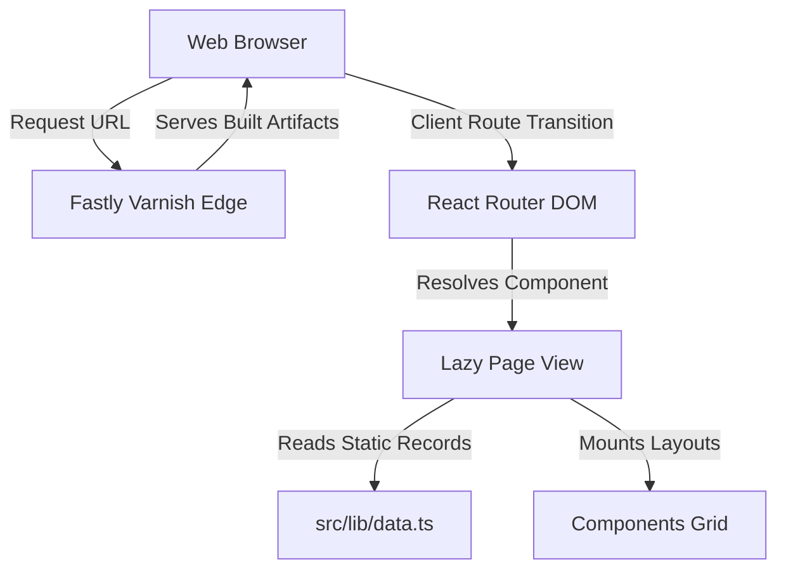
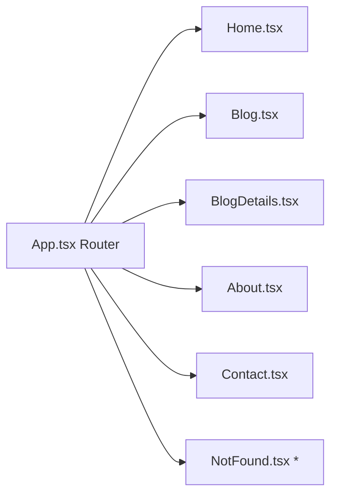
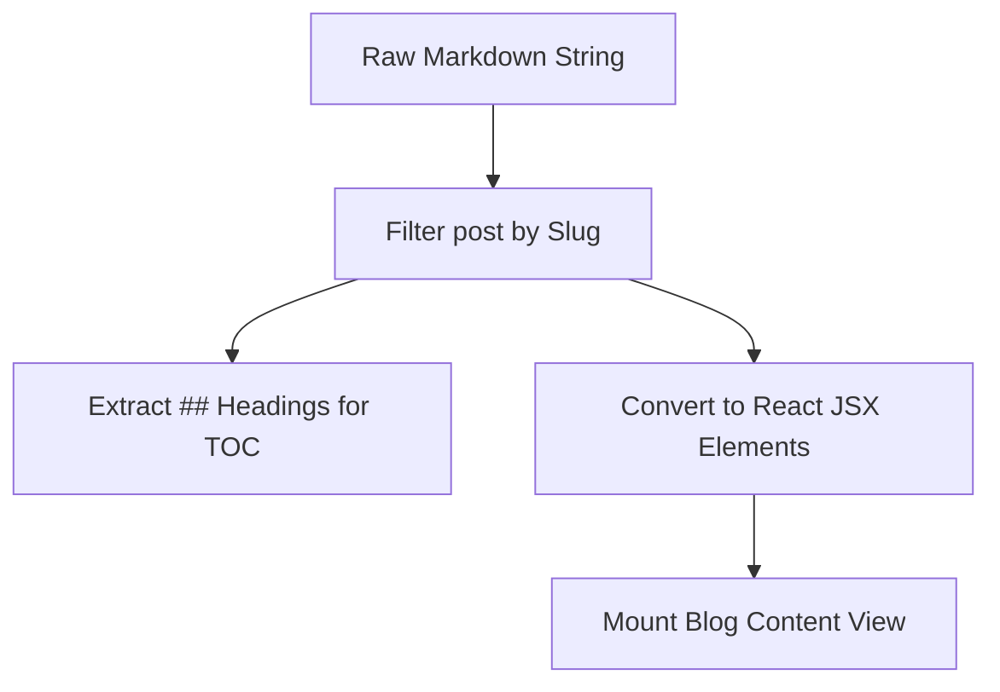
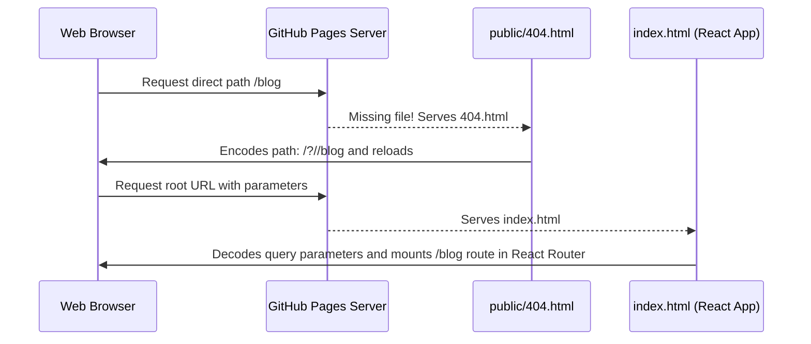

# Project Architecture Documentation (ARCHITECTURE.md)

This document describes the high-level design, component boundaries, routing, state management, and deployment flow of the Sahaya Savari blog platform.

---

## 1. System Overview

The application is built as a single-page React application (SPA) compiled using Vite and deployed to GitHub Pages. It relies purely on client-side routing, static local data stores, and a custom Markdown parsing subsystem.



---

## 2. Directory Structure

```text
D:\GITHUB\BLOG
├── .github/
│   └── workflows/
│       └── deploy.yml          # GitHub Actions build and deploy pipeline configuration
├── public/                     # Static files directly copied into build output (dist/)
│   ├── 404.html                # Intercepts SPA sub-paths and encodes paths to query parameters
│   ├── CNAME                   # Maps custom domain blog.sahayasavari.me
│   ├── robots.txt              # Standard web crawler rules
│   └── sitemap.xml             # Search engine crawler index XML
├── src/                        # React source code root
│   ├── components/             # Reusable UI component modules (Grid, Card, SearchBar, etc.)
│   ├── hooks/                  # Custom React hooks
│   ├── lib/                    # Storage folders for static data and settings configs
│   ├── pages/                  # Route views compiled as chunks via lazy loading
│   ├── styles/                 # Tailwind layout layers and custom Brutalist utility CSS
│   ├── types/                  # TypeScript contract interface definitions
│   ├── utils/                  # Utility formatters, slugifiers, and pagination helpers
│   ├── App.tsx                 # Core Application layout wrapper defining SPA routes
│   └── main.tsx                # Entry script rendering React DOM inside index.html
└── vite.config.ts              # Configures alias resolutions and manual bundle chunking
```

---

## 3. Client-Side Routing

The routing is implemented in [App.tsx](file:///D:/GITHUB/blog/src/App.tsx) using `BrowserRouter` and `Routes`. 
To optimize initial bundle sizes, all pages are lazy-loaded via code-splitting. A fallback loader (`LoadingSpinner.tsx`) is rendered while the bundle chunk is fetched in the background.



---

## 4. Blog & Markdown Subsystem

Since the application does not make network requests to a CMS database, the data flow is fully static. Blog posts are stored as string arrays containing markdown text within [src/lib/data.ts](file:///D:/GITHUB/blog/src/lib/data.ts).

### Content Rendering Pipeline
When a detailed article is requested by slug:
1. `BlogDetails.tsx` imports the dataset array.
2. It selects the matched post object using the slug param.
3. A local parser iterates over the markdown body text to:
   - Extract raw text.
   - Generate unique IDs for headings to enable table-of-contents (TOC) page anchors.
   - Render lists, blocks, custom tables, and raw HTML safely.



---

## 5. Routing Fallback (SPA Redirection)

GitHub Pages is a static file server. Direct navigation to sub-paths like `/blog` or page reloads will result in a 404 error because the server expects to find a static file at `blog/index.html`. 
To solve this, we use a redirection handshake:



---

## 6. CSS & Tailwind Layering

The application uses Tailwind CSS inside [globals.css](file:///D:/GITHUB/blog/src/styles/globals.css) layered as follows:
- `@layer base` - Defines font defaults (`Inter`, `Playfair Display`), colors, and browser defaults.
- `@layer utilities` - Brutalist outlines, offset borders, custom marquee keyframes, and hiding scrollbars.

---

## 7. Deployment Pipeline

Deployments are strictly automated:
1. Every commit pushed to `main` triggers a GitHub Actions runner (`deploy.yml`).
2. The runner checks out code, runs `npm install`, runs `npm run build`, and generates the compiled output in `dist/`.
3. The build artifact is uploaded and deployed to GitHub Pages.
4. Custom domain `blog.sahayasavari.me` is mapped automatically via the static `CNAME` file.
