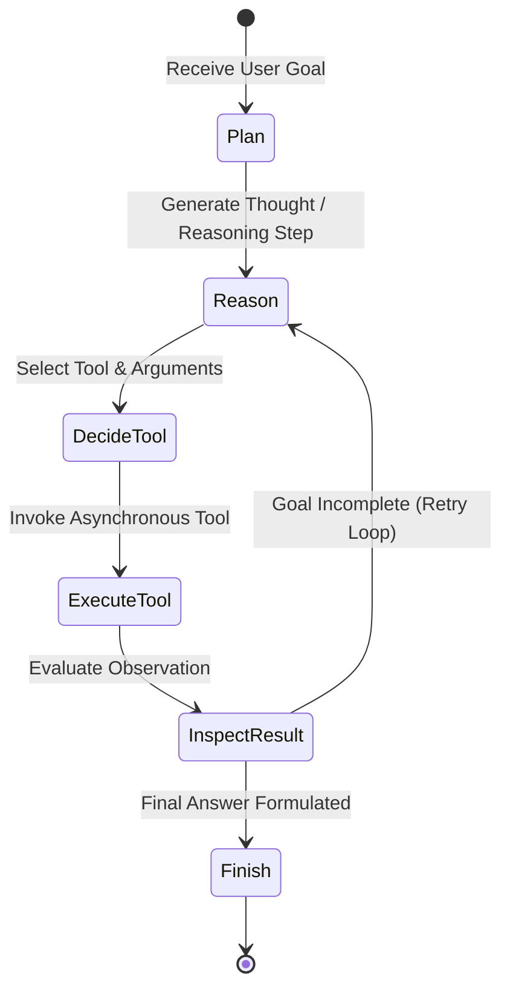

# Building Autonomous AI Agents from Scratch in Async Python

While high-level orchestration libraries provide rapid prototyping, production AI engineering requires understanding the fundamental mechanics of autonomous agents: the **ReAct (Reason + Act) loop**, state inspection, tool execution dispatch, and resilience against tool execution exceptions.

In this guide, we build a production-grade, asynchronous AI agent framework from first principles in standard Python using `asyncio` and `Pydantic`.

---

## 🔁 The ReAct Execution Loop



---

## 💻 Pure Python Agent Implementation

```python
import asyncio
import json
from typing import Callable, Dict, Any, List
from pydantic import BaseModel, Field

class ToolCall(BaseModel):
    tool_name: str
    arguments: Dict[str, Any]

class AgentStepResult(BaseModel):
    thought: str
    tool_call: ToolCall | None = None
    final_answer: str | None = None

class AgentToolRegistry:
    def __init__(self):
        self._tools: Dict[str, Callable] = {}

    def register(self, name: str):
        def decorator(func: Callable):
            self._tools[name] = func
            return func
        return decorator

    async def execute(self, name: str, args: Dict[str, Any]) -> str:
        if name not in self._tools:
            return f"Error: Tool '{name}' is not registered."
        try:
            res = await self._tools[name](**args)
            return str(res)
        except Exception as e:
            return f"Tool Execution Exception: {str(e)}"

# Instantiate registry
registry = AgentToolRegistry()

@registry.register("calculator")
async def calculator(expression: str) -> str:
    """Evaluates mathematical expression."""
    try:
        # Safe math evaluation for demonstration
        result = eval(expression, {"__builtins__": None}, {})
        return f"Result: {result}"
    except Exception as err:
        return f"Invalid expression: {err}"

@registry.register("query_database")
async def query_database(query: str) -> str:
    """Simulates database retrieval."""
    await asyncio.sleep(0.1)
    return f"Record returned for query: '{query}' -> Status: ACTIVE"

# Async Agent Loop
async def run_agent(goal: str, max_steps: int = 5) -> str:
    print(f"Goal: {goal}")
    history: List[str] = [f"User Goal: {goal}"]

    for step in range(1, max_steps + 1):
        print(f"\n--- ReAct Step {step} ---")
        # Simulate LLM decision making logic
        if step == 1:
            decision = AgentStepResult(
                thought="Need to check user status in database before calculation.",
                tool_call=ToolCall(tool_name="query_database", arguments={"query": "user_102"})
            )
        elif step == 2:
            decision = AgentStepResult(
                thought="Database returned active status. Now calculating usage quota.",
                tool_call=ToolCall(tool_name="calculator", arguments={"expression": "100 - 15"})
            )
        else:
            decision = AgentStepResult(
                thought="All information acquired.",
                final_answer="User user_102 is ACTIVE with 85 remaining quota points."
            )

        print(f"Thought: {decision.thought}")
        if decision.final_answer:
            return decision.final_answer

        if decision.tool_call:
            obs = await registry.execute(decision.tool_call.tool_name, decision.tool_call.arguments)
            print(f"Observation: {obs}")
            history.append(f"Observation from {decision.tool_call.tool_name}: {obs}")

    return "Agent reached max steps without completing goal."

if __name__ == "__main__":
    result = asyncio.run(run_agent("Check quota status for user_102"))
    print(f"\nFinal Result: {result}")
```

---

## 🔄 Related Cluster Articles & Next Reading

- ➡️ **Next Reading**: [Building Multi-Agent Workflows with LangGraph](/blog/langgraph-tutorial)
- 🔗 [The Ultimate AI Engineering Roadmap (2026 Edition)](/blog/ai-engineering-roadmap-2026)
- 🔗 [Fine-Tuning LLMs in 2026: From QLoRA to Local Serving](/blog/fine-tuning-llms)
