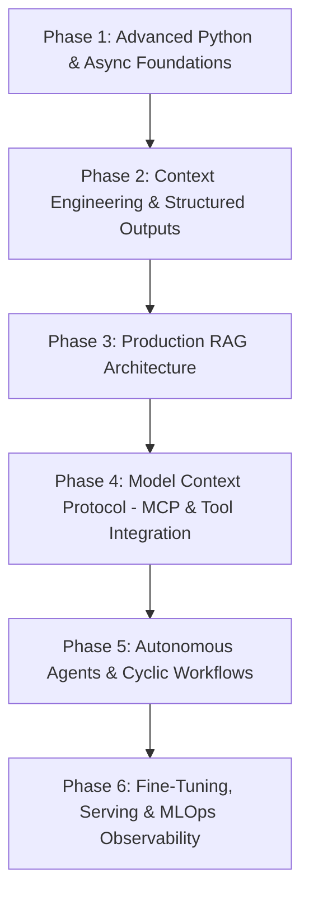
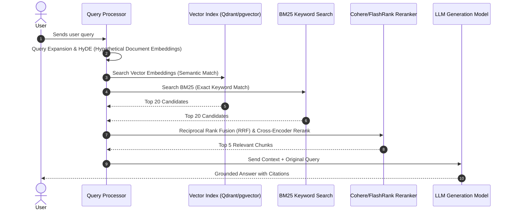

# The Ultimate AI Engineering Roadmap (2026 Edition): From Fundamentals to Autonomous Agents

The software engineering landscape has undergone a tectonic shift. In 2026, building AI-powered applications is no longer confined to training PyTorch models from scratch or fine-tuning ResNet architectures in Jupyter Notebooks. The modern **AI Engineer** operates at the intersection of **software engineering, systems architecture, prompt orchestration, retrieval systems, autonomous agentic workflows, and production MLOps**.

This comprehensive, step-by-step roadmap outlines the exact skill tree, technologies, architectural patterns, and production practices required to master AI Engineering in 2026.

---

## 🚀 Quick Summary & Key Takeaways

- **The Shift**: AI Engineering shifts the focus from model creation to model orchestration, context engineering, retrieval augmentation, and agentic autonomy.
- **Core Pillars**: Python Mastery & Data Pipelines, Vector Search & RAG, Model Context Protocol (MCP), Agentic Workflows (LangGraph/CrewAI), Local Fine-Tuning (QLoRA), and Observability/MLOps (LangSmith/Phoenix).
- **Production Standard**: Toy wrapper scripts using basic OpenAI completions are obsolete. Production AI systems require determinism, structured outputs (Pydantic/Instructor), fallback routing, streaming, and evaluation suites.

---

## 🎯 Who Should Read This Guide

- **Software Engineers & Backend Developers**: Looking to transition into full-fledged AI Engineering roles.
- **Python Developers & Data Analysts**: Seeking to elevate their machine learning workflows into scalable enterprise applications.
- **Computer Science & AI Students**: Wanting an industry-aligned blueprint for internships and entry-level positions in 2026.

---

## 📋 Prerequisites & Ecosystem Version Compatibility

| Technology | Recommended Version | Primary Use Case |
| :--- | :--- | :--- |
| **Python** | `3.12+` / `3.13` | Core application logic & async orchestration |
| **Pydantic** | `v2.8+` | Structured outputs, schema enforcement & data validation |
| **FastAPI** | `0.111+` | Asynchronous high-performance API endpoints |
| **LangGraph** | `0.1.0+` | Stateful, multi-agent orchestration & cyclic graph execution |
| **LlamaIndex** | `0.10+` | Enterprise data indexing & hybrid vector/sparse retrieval |
| **Ollama / vLLM** | Latest 2026 Release | Local LLM inference & high-throughput serving |

---

## 🗺️ The 6-Phase AI Engineering Skill Tree



---

## Phase 1: Advanced Python & Asynchronous Systems

AI applications are heavily I/O-bound (network calls to LLM APIs, vector database index queries, embedding generation). Relying on synchronous Python code causes severe bottlenecks.

### Essential Skills to Master:
1. **AsyncIO Control Flow**: `async/await`, task groups (`asyncio.TaskGroup`), semaphores for rate-limiting, and async generators for real-time SSE (Server-Sent Events) streaming.
2. **Type Safety & Data Classes**: Static typing with `mypy` or `pyright` to prevent runtime type mismatch crashes during prompt template parsing.

### Production Example: Async Concurrent LLM Querying with Semaphores

```python
import asyncio
import time
from typing import List, Dict, Any
from pydantic import BaseModel

class PromptTask(BaseModel):
    task_id: str
    prompt: str

class TaskResult(BaseModel):
    task_id: str
    response: str
    latency_ms: float

async def mock_llm_inference(semaphore: asyncio.Semaphore, task: PromptTask) -> TaskResult:
    async with semaphore:
        start_time = time.perf_counter()
        # Simulate network latency to LLM provider
        await asyncio.sleep(0.3)
        elapsed = (time.perf_counter() - start_time) * 1000
        return TaskResult(
            task_id=task.task_id,
            response=f"Processed response for prompt: '{task.prompt[:20]}...'",
            latency_ms=round(elapsed, 2)
        )

async def batch_process_prompts(tasks: List[PromptTask], max_concurrency: int = 5) -> List[TaskResult]:
    semaphore = asyncio.Semaphore(max_concurrency)
    async with asyncio.TaskGroup() as tg:
        coroutines = [tg.create_task(mock_llm_inference(semaphore, t)) for t in tasks]
    
    return [task.result() for task in coroutines]

# Execution entry point
if __name__ == "__main__":
    sample_tasks = [
        PromptTask(task_id=f"t-{i}", prompt=f"Analyze system query logs for error code {i}")
        for i in range(10)
    ]
    results = asyncio.run(batch_process_prompts(sample_tasks, max_concurrency=3))
    for r in results:
        print(f"[{r.task_id}] Finished in {r.latency_ms}ms -> {r.response}")
```

---

## Phase 2: Context Engineering & Guaranteed Structured Outputs

In production, natural language output from LLMs is unreliable for downstream database insertion or workflow automation. **Context Engineering** and **Structured Validation** ensure models return strict JSON conforming to Pydantic schemas.

### Key Frameworks:
- **Pydantic V2**: Ultra-fast Rust-backed schema validation.
- **Instructor / Function Calling**: Forcing models like Gemini 1.5/Pro or Claude 3.5 Sonnet to invoke specific JSON schemas via tool parameters.

### Production Pattern: Enforcing Valid JSON Output

```python
from pydantic import BaseModel, Field
from typing import List, Optional

class KeyEntity(BaseModel):
    entity_name: str = Field(description="Name of the person, company, or concept")
    category: str = Field(description="Classification e.g. ORGANIZATION, PERSON, FRAMEWORK")
    confidence_score: float = Field(ge=0.0, le=1.0, description="Confidence rating between 0 and 1")

class CodeReviewSummary(BaseModel):
    pull_request_id: str
    overall_status: str = Field(description="APPROVE, REJECT, or REQUEST_CHANGES")
    critical_vulnerabilities: List[str] = Field(default_factory=list)
    suggested_refactors: List[str] = Field(default_factory=list)
    extracted_entities: List[KeyEntity] = Field(default_factory=list)

# Schema example for LLM Tool Calling Payload
print(CodeReviewSummary.model_json_schema())
```

---

## Phase 3: Enterprise Retrieval-Augmented Generation (RAG)

Naive RAG (Chunk Text -> Embed -> Naive Top-K Vector Search -> Prompt) suffers from low precision, hallucination, and missing context. **Enterprise RAG in 2026** uses hybrid search, query expansion, and re-ranking.



### Production Best Practices for RAG:
1. **Hybrid Retrieval**: Combine dense semantic embeddings with sparse lexical search (BM25) to catch both conceptual intent and exact technical terms (e.g. error codes, variable names).
2. **Cross-Encoder Re-Ranking**: Use models like Cohere Rerank or FlashRank to rescore initial query-document pairs before inserting into prompt context window.
3. **Parent-Child Chunking**: Store smaller child chunks for precise retrieval and map back to parent document headers for rich LLM context generation.

---

## Phase 4: Model Context Protocol (MCP)

Introduced by Anthropic and standardizing open-source LLM integrations in 2026, **Model Context Protocol (MCP)** provides a secure, standard client-server protocol for connecting AI models to external tools, databases, and local file systems.

### Architecting an MCP Server in Python

```python
# Conceptual MCP Server implementation
from mcp.server.fastmcp import FastMCP

mcp = FastMCP("Database Explorer MCP Server")

@mcp.tool()
async def execute_read_only_query(sql_query: str) -> str:
    """Executes a validated read-only SQL query against production replica."""
    if not sql_query.strip().lower().startswith("select"):
        raise ValueError("Security Violation: Only SELECT queries are permitted.")
    
    # Execute against database replica...
    return f"Query executed successfully: [{sql_query}] -> Result Set Returned."

if __name__ == "__main__":
    mcp.run()
```

---

## Phase 5: Stateful Autonomous Agents & LangGraph

Linear chains (`LLM -> Tool -> Result`) fail on complex, non-deterministic tasks. Enterprise agents in 2026 are built as **stateful directed cyclic graphs** with human-in-the-loop checkpoints and dynamic plan correction.

### LangGraph Cyclic State Flow

```python
from typing import TypedDict, Annotated, Sequence
import operator

class AgentState(TypedDict):
    messages: Annotated[Sequence[str], operator.add]
    next_step: str
    retry_count: int
    is_satisfied: bool

def research_agent_node(state: AgentState) -> AgentState:
    print(f"--- Executing Research Agent Step (Retry: {state['retry_count']}) ---")
    return {
        "messages": ["Retrieved internal system architectural documents."],
        "next_step": "evaluate",
        "retry_count": state["retry_count"] + 1,
        "is_satisfied": state["retry_count"] >= 1
    }

def evaluator_router(state: AgentState) -> str:
    if state["is_satisfied"]:
        return "END"
    return "research"
```

---

## ⚡ Common Mistakes & How to Avoid Them

| Common Mistake | Root Cause | Production Solution |
| :--- | :--- | :--- |
| **Unbounded Prompt Latency** | Sequential API calls to vector store & LLMs | Implement async chunk streaming and parallel hybrid search |
| **Context Window Overflow** | Dumping full documents into system prompts | Use semantic chunking + hybrid reranking + token counting |
| **Hallucinated Tool Calls** | Unstructured text output parsing | Enforce Instructor / Pydantic schemas with fallback retry loops |
| **Silent API Rate Limit Failures** | Lacking exponential backoff | Use `tenacity` retry decorators with jitter and fallback models |

---

## ❓ Frequently Asked Questions (FAQs)

### Q1: Do I need a Ph.D. in Deep Learning to become an AI Engineer in 2026?
**No.** While understanding foundational transformer math (attention mechanisms, positional embeddings) is beneficial, the primary role of an AI Engineer is **software systems architecture, context engineering, tool orchestration, and product reliability**.

### Q2: Should I use LangChain, LlamaIndex, or build custom agent loops?
For simple API integrations, pure Python with Pydantic and AsyncIO is ideal. For enterprise multi-agent workflows, state management frameworks like **LangGraph** provide pre-built state persistence, time-travel debugging, and human-in-the-loop validation.

---

## 📚 References & Recommended Reading

- [Anthropic Model Context Protocol (MCP) Specification](https://modelcontextprotocol.io)
- [FastAPI & AsyncIO Production Guidelines](https://fastapi.tiangolo.com/)
- [LangGraph Documentation for Stateful Agents](https://langchain-ai.github.io/langgraph/)
- [Pydantic V2 Documentation](https://docs.pydantic.dev/latest/)

---

## 🔄 Related Cluster Articles & Next Reading

- ➡️ **Next Reading**: [Prompt Engineering Guide (2026): Enterprise Patterns & System Prompts](/blog/prompt-engineering-guide)
- 🔗 [RAG Explained: From Naive Vector Search to Enterprise Hybrid Systems](/blog/rag-explained)
- 🔗 [Model Context Protocol (MCP): Building Standardization Layer for AI Tools](/blog/mcp-explained)
- 🔗 [Building Autonomous AI Agents from Scratch in Async Python](/blog/ai-agents-from-scratch)
