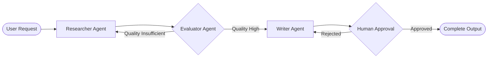

# Building Multi-Agent Workflows with LangGraph: Cyclic Graphs & Persistence

Linear chains fail when autonomous applications require iteration, error recovery, and multiple specialized agents collaborating on complex goals. **LangGraph** provides a low-level framework for building stateful, multi-actor applications using directed cyclic graphs.

This tutorial covers graph state definition, node implementation, conditional edge routing, state check-pointing, and human-in-the-loop approval.

---

## 🕸️ Multi-Agent Architecture Pattern



---

## 💻 Python Example: LangGraph Agent Graph

```python
from typing import TypedDict, Annotated, Sequence
import operator

class MultiAgentState(TypedDict):
    task: str
    draft: str
    feedback: str
    iterations: int
    is_approved: bool

def researcher_agent(state: MultiAgentState) -> MultiAgentState:
    print(f"Executing Researcher Agent (Iteration {state['iterations'] + 1})")
    return {
        "draft": f"Draft content research output based on task: '{state['task']}'",
        "iterations": state["iterations"] + 1
    }

def evaluator_agent(state: MultiAgentState) -> MultiAgentState:
    print("Evaluating Draft Quality...")
    quality_passed = state["iterations"] >= 2
    return {
        "feedback": "Passed quality threshold." if quality_passed else "Need deeper evidence.",
        "is_approved": quality_passed
    }

def router_conditional(state: MultiAgentState) -> str:
    if state["is_approved"]:
        return "approved"
    return "revise"

# Entry Execution Test
if __name__ == "__main__":
    current_state: MultiAgentState = {
        "task": "Synthesize AI Agent Safety Research 2026",
        "draft": "",
        "feedback": "",
        "iterations": 0,
        "is_approved": False
    }
    
    # Simulate cyclic execution graph
    while not current_state["is_approved"]:
        current_state.update(researcher_agent(current_state))
        current_state.update(evaluator_agent(current_state))
        print(f"State Update: Approved={current_state['is_approved']} | Feedback='{current_state['feedback']}'")
```

---

## 🔄 Related Cluster Articles & Next Reading

- ➡️ **Next Reading**: [Python Interview Questions (2026): 50+ Senior Coding Challenges](/blog/python-interview-questions)
- 🔗 [Building Autonomous AI Agents from Scratch in Async Python](/blog/ai-agents-from-scratch)
- 🔗 [The Ultimate AI Engineering Roadmap (2026 Edition)](/blog/ai-engineering-roadmap-2026)
