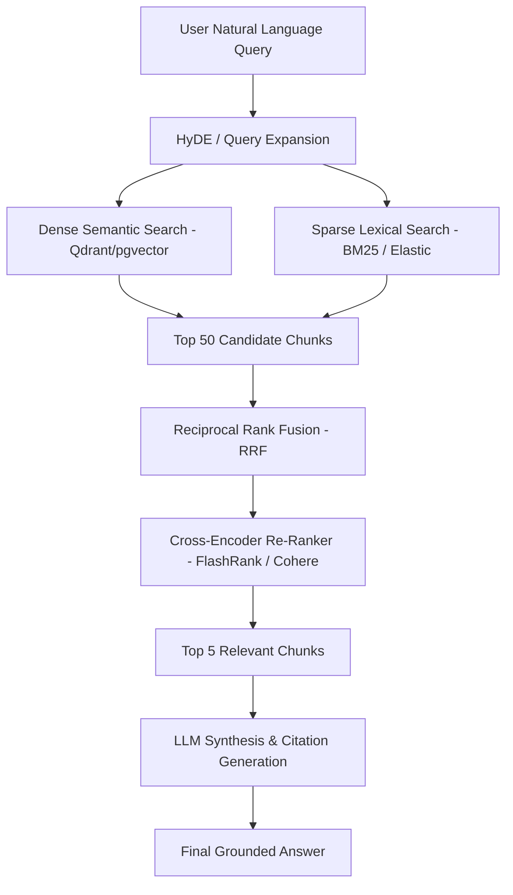

# RAG Explained: From Naive Vector Search to Enterprise Hybrid Retrieval Systems

Large Language Models (LLMs) possess vast general knowledge but lack access to private enterprise databases, real-time metrics, and internal documentation. **Retrieval-Augmented Generation (RAG)** bridges this gap by querying an external knowledge base at inference time and injecting relevant documents directly into the model's context window.

However, naive vector search (`Chunk -> Embed -> Cosine Similarity -> Prompt`) frequently fails in enterprise scenarios due to poor chunk boundaries, missing exact keyword matches, and retrieval noise.

This guide details how to build a **Production Enterprise RAG System** using Hybrid Search, Reciprocal Rank Fusion (RRF), and Cross-Encoder Re-Ranking.

---

## 🏗️ Production RAG System Architecture



---

## ⚡ Key Architectural Concepts

### 1. Dense vs. Sparse Retrieval
- **Dense Embeddings (Semantic)**: Converts sentences into high-dimensional vectors (e.g. OpenAI `text-embedding-3-small`, BGE-M3). Captures meaning and synonyms (e.g., "automobile" matches "car").
- **Sparse Retrieval (BM25 / Keyword)**: Counts exact term frequencies. Catches specific SKU numbers, function names (`asyncio.TaskGroup`), and proper nouns that dense embeddings miss.

### 2. Reciprocal Rank Fusion (RRF)
```text
RRF_Score(doc) = SUM( 1 / (60 + rank(doc)) )
```

Where `rank(doc)` is the 1-based rank position of the document in each respective search strategy (vector vs keyword).

---

## 💻 Python Implementation: Hybrid Rerank Pipeline

```python
import math
from typing import List, Dict, Any
from pydantic import BaseModel

class ScoredChunk(BaseModel):
    chunk_id: str
    content: str
    score: float

def reciprocal_rank_fusion(
    vector_results: List[ScoredChunk],
    keyword_results: List[ScoredChunk],
    k: int = 60
) -> List[ScoredChunk]:
    """Combines dense vector search and sparse BM25 results using RRF."""
    scores: Dict[str, float] = {}
    content_map: Dict[str, str] = {}

    # Process vector rankings
    for rank, doc in enumerate(vector_results):
        scores[doc.chunk_id] = scores.get(doc.chunk_id, 0.0) + (1.0 / (k + rank + 1))
        content_map[doc.chunk_id] = doc.content

    # Process keyword rankings
    for rank, doc in enumerate(keyword_results):
        scores[doc.chunk_id] = scores.get(doc.chunk_id, 0.0) + (1.0 / (k + rank + 1))
        content_map[doc.chunk_id] = doc.content

    # Sort descending by fused score
    sorted_chunks = sorted(scores.items(), key=lambda item: item[1], reverse=True)
    return [
        ScoredChunk(chunk_id=cid, content=content_map[cid], score=round(score, 5))
        for cid, score in sorted_chunks
    ]

# Demonstration test
if __name__ == "__main__":
    dense_hits = [
        ScoredChunk(chunk_id="doc-1", content="FastAPI supports async endpoints natively.", score=0.89),
        ScoredChunk(chunk_id="doc-2", content="Pydantic manages type validation in Python.", score=0.82)
    ]
    sparse_hits = [
        ScoredChunk(chunk_id="doc-3", content="FastAPI route dependency injection guide.", score=12.4),
        ScoredChunk(chunk_id="doc-1", content="FastAPI supports async endpoints natively.", score=9.8)
    ]
    fused = reciprocal_rank_fusion(dense_hits, sparse_hits)
    for idx, item in enumerate(fused, 1):
        print(f"Rank {idx}: [{item.chunk_id}] (Score: {item.score}) -> {item.content}")
```

---

## ❓ Frequently Asked Questions (FAQs)

### Q1: What chunk size should I use for RAG?
For technical documentation, **256 to 512 tokens** with a 50-token overlap balances precision and context. Pair small chunks with parent-document storage for best results.

---

## 🔄 Related Cluster Articles & Next Reading

- ➡️ **Next Reading**: [Model Context Protocol (MCP): Building Standardization Layer for AI Tools](/blog/mcp-explained)
- 🔗 [The Ultimate AI Engineering Roadmap (2026 Edition)](/blog/ai-engineering-roadmap-2026)
- 🔗 [Prompt Engineering Guide (2026): Advanced Enterprise Patterns](/blog/prompt-engineering-guide)
