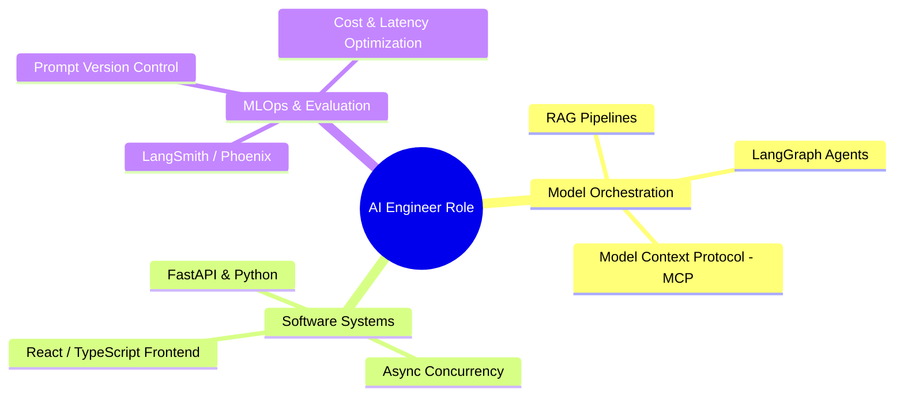

# AI Engineer Career Path (2026 Edition): Skills, Projects & Salary Trajectory

The **AI Engineer** role has emerged as the fastest-growing engineering title across global technology firms. Operating between traditional Software Engineers and Machine Learning Research Scientists, AI Engineers focus on applying, orchestrating, and scaling foundational models to solve real-world user problems.

This career blueprint outlines industry expectations, high-impact project ideas, and salary benchmarks for 2026.

---

## 🎯 Primary Responsibilities Matrix

---

## 💡 High-Impact AI Projects That Get You Hired in 2026

1. **Enterprise Autonomous Code Review Agent**: An agentic pipeline that integrates via GitHub Webhooks, fetches PR diffs, executes security analysis via LLMs, and posts inline review comments.
2. **Hybrid RAG Platform for Complex Documents**: A multi-modal RAG service processing PDFs with tables and diagrams using hybrid BM25/vector search and cross-encoder re-ranking.
3. **Local Private LLM Tooling Server**: An MCP-compliant server providing LLMs safe read-only access to local databases and system logs via FastMCP.

---

## 🔄 Related Cluster Articles & Next Reading

- ➡️ **Next Reading**: [Crafting an ATS-Friendly Tech Resume for Software & AI Engineers](/blog/tech-resume-guide)
- 🔗 [Building a High-Impact Developer Portfolio That Gets Hired](/blog/developer-portfolio-guide)
- 🔗 [Optimizing Your GitHub Profile & Open Source Presence](/blog/github-profile-readme-guide)
