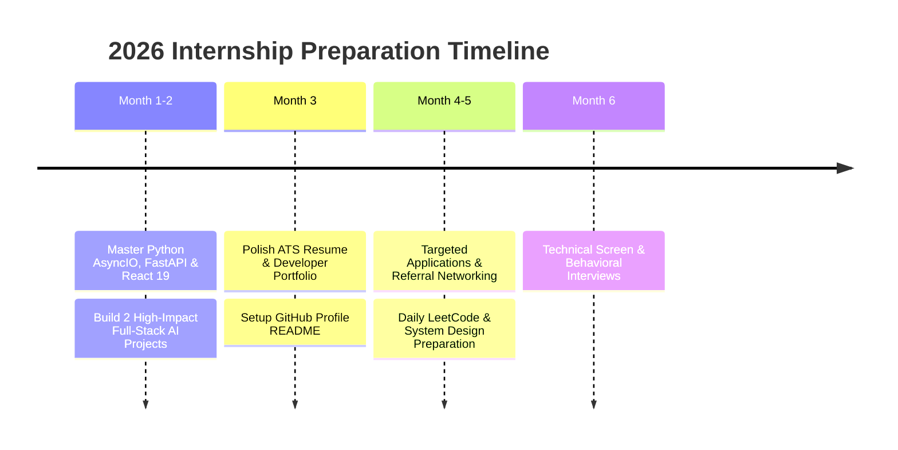

# Landing Software & AI Engineering Internships (Summer/Fall 2026)

Securing a software engineering or AI internship in 2026 requires a proactive, multi-pronged approach: building production-ready side projects, networking via targeted outreach, passing technical screen interviews, and demonstrating domain competence in AI and full-stack web development.

This guide outlines a month-by-month tactical strategy for landing **Summer/Fall 2026 internships**.

---

## 📅 Month-by-Month Action Plan

---

## 🔄 Related Cluster Articles & Next Reading

- ➡️ **Next Reading**: [The Ultimate AI Engineering Roadmap (2026 Edition)](/blog/ai-engineering-roadmap-2026)
- 🔗 [AI Engineer Career Path (2026 Edition)](/blog/ai-engineer-career-path)
- 🔗 [Crafting an ATS-Friendly Tech Resume](/blog/tech-resume-guide)
