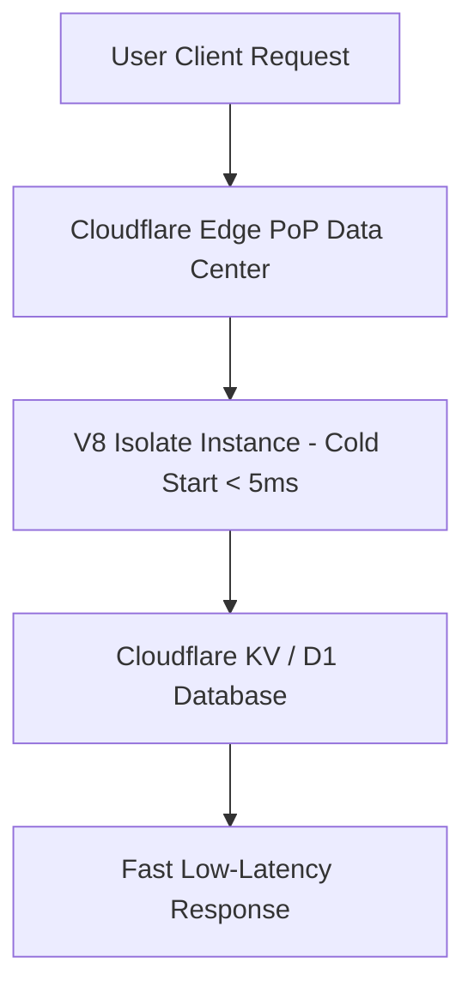

# Cloudflare Workers & Pages: Edge Computing Architecture & Email Routing

**Cloudflare** operates one of the world's fastest edge networks across 300+ global data centers. By executing code on V8 isolate engines via **Cloudflare Workers** and hosting static sites on **Cloudflare Pages**, applications achieve sub-50ms latency globally without traditional origin server bottlenecks.

This guide details building Cloudflare Workers, configuring Wrangler CLI, storing data in Cloudflare KV / D1, and configuring Cloudflare Email Routing (`contact@sahayasavari.me`).

---

## ⚡ Cloudflare V8 Isolate vs Traditional Node Container



---

## 💻 JavaScript Example: Cloudflare Worker Script (`worker.js`)

```javascript
export default {
  async fetch(request, env, ctx) {
    const url = new URL(request.url);

    // Route: API Health Check
    if (url.pathname === "/api/health") {
      return new Response(JSON.stringify({
        status: "ONLINE",
        edge_location: request.cf?.colo || "UNKNOWN",
        country: request.cf?.country || "UNKNOWN",
        timestamp: new Date().toISOString()
      }), {
        headers: {
          "Content-Type": "application/json",
          "Cache-Control": "no-store"
        }
      });
    }

    return new Response("Cloudflare Edge Worker Active", { status: 200 });
  }
};
```

---

## 🔄 Related Cluster Articles & Next Reading

- ➡️ **Next Reading**: [AI Engineer Career Path (2026): Skills, Projects & Salary](/blog/ai-engineer-career-path)
- 🔗 [Docker for Developers: Containerization Best Practices](/blog/docker-for-developers)
- 🔗 [Vercel Serverless Architecture & Edge Middleware](/blog/vercel-deployment)
