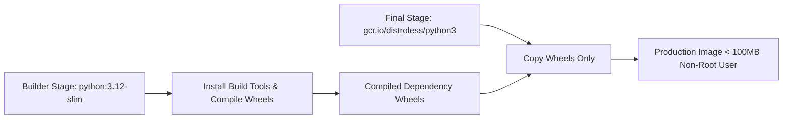

# Docker for Developers: Containerization Best Practices & Multi-Stage Builds

Containerization with **Docker** ensures application code behaves identically across developer workstations, CI/CD pipelines, and production cloud clusters. However, inefficient Dockerfiles often produce bloated multi-gigabyte images, leak secrets, and run as root.

This guide details authoring production-ready **multi-stage Dockerfiles** for Python FastAPI applications to achieve sub-100MB image sizes with non-root security.

---

## 🐋 Multi-Stage Build Architecture



---

## 💻 Production Multi-Stage `Dockerfile` (Python FastAPI)

```dockerfile
# ==========================================
# STAGE 1: Builder Stage
# ==========================================
FROM python:3.12-slim AS builder

WORKDIR /app

ENV PYTHONDONTWRITEBYTECODE=1 \
    PYTHONUNBUFFERED=1

RUN apt-get update && apt-get install -y --no-install-recommends \
    build-essential \
    && rm -rf /var/lib/apt/lists/*

COPY requirements.txt .
RUN pip wheel --no-cache-dir --no-deps --wheel-dir /app/wheels -r requirements.txt

# ==========================================
# STAGE 2: Final Minimal Runtime Stage
# ==========================================
FROM python:3.12-slim AS runner

WORKDIR /app

ENV PYTHONDONTWRITEBYTECODE=1 \
    PYTHONUNBUFFERED=1 \
    PORT=8000

# Create non-root system user
RUN groupadd -g 10001 appgroup && \
    useradd -u 10001 -g appgroup -s /bin/sh appuser

COPY --from=builder /app/wheels /wheels
COPY --from=builder /app/requirements.txt .

RUN pip install --no-cache-dir /wheels/* && rm -rf /wheels

COPY . .

# Set ownership and switch user
RUN chown -R appuser:appgroup /app
USER appuser

EXPOSE 8000

HEALTHCHECK --interval=30s --timeout=5s --start-period=5s --retries=3 \
  CMD python -c "import urllib.request; urllib.request.urlopen('http://localhost:8000/health')" || exit 1

CMD ["python", "-m", "uvicorn", "main:app", "--host", "0.0.0.0", "--port", "8000"]
```

---

## 🔄 Related Cluster Articles & Next Reading

- ➡️ **Next Reading**: [Kubernetes Fundamentals: Pods, Services & Deployments](/blog/kubernetes-basics)
- 🔗 [GitHub Actions CI/CD Pipelines & Automated Release Workflows](/blog/github-actions-ci-cd)
- 🔗 [Cloudflare Workers & Pages: Edge Computing Architecture](/blog/cloudflare-workers-pages)
