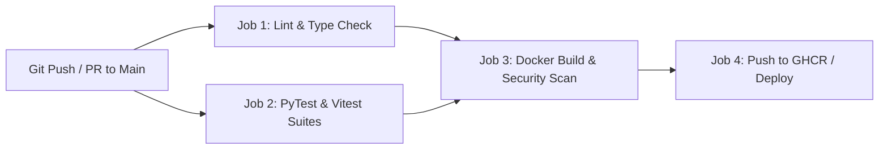

# GitHub Actions CI/CD Pipelines: Automated Testing, Linting & Container Deployment

Automated **Continuous Integration and Continuous Deployment (CI/CD)** pipelines prevent broken code, security vulnerabilities, and unformatted commits from reaching production. **GitHub Actions** provides workflow automation integrated directly into GitHub repositories.

This guide constructs an enterprise pipeline for automated Python/React testing, linting, Docker image building, and container registry publishing.

---

## 🚀 Enterprise CI/CD Pipeline Workflow



---

## 💻 Workflow Example (`.github/workflows/deploy.yml`)

```yaml
name: CI/CD Pipeline

on:
  push:
    branches: [ main ]
  pull_request:
    branches: [ main ]

jobs:
  test-and-lint:
    runs-on: ubuntu-latest
    steps:
      - name: Checkout Code Repository
        uses: actions/checkout@v4

      - name: Set up Python 3.12
        uses: actions/setup-python@v5
        with:
          python-version: '3.12'
          cache: 'pip'

      - name: Install Dependencies
        run: |
          python -m pip install --upgrade pip
          pip install ruff pytest pydantic

      - name: Run Ruff Linter & Syntax Checker
        run: ruff check .

      - name: Execute Pytest Suite
        run: pytest

  build-and-push:
    needs: test-and-lint
    if: github.ref == 'refs/heads/main'
    runs-on: ubuntu-latest
    steps:
      - name: Checkout Repository
        uses: actions/checkout@v4

      - name: Log in to GitHub Container Registry
        uses: docker/login-action@v3
        with:
          registry: ghcr.io
          username: ${{ github.actor }}
          password: ${{ secrets.GITHUB_TOKEN }}

      - name: Build & Push Docker Image
        uses: docker/build-push-action@v5
        with:
          context: .
          push: true
          tags: ghcr.io/${{ github.repository }}:latest
```

---

## 🔄 Related Cluster Articles & Next Reading

- ➡️ **Next Reading**: [Firebase Web Hosting & Cloud Functions Deployment](/blog/firebase-web-hosting)
- 🔗 [Docker for Developers: Containerization Best Practices](/blog/docker-for-developers)
- 🔗 [Kubernetes Fundamentals: Pods, Services & Deployments](/blog/kubernetes-basics)
