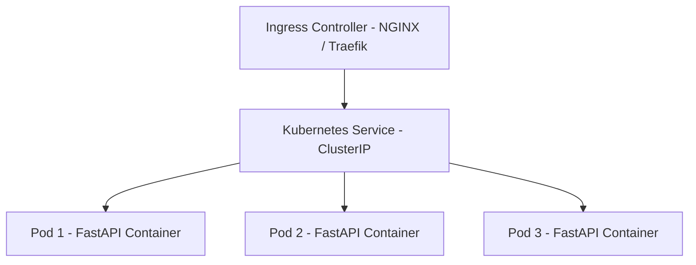

# Kubernetes Fundamentals: Pods, Services, Ingress & Production Deployments

**Kubernetes (K8s)** is the industry-standard container orchestrator for automating deployment, scaling, and management of containerized workloads.

This guide details authoring production **Deployment** and **Service** manifests, configuration secrets, readiness probes, and rolling update strategies.

---

## 🏗️ Kubernetes Cluster Topology



---

## 💻 Manifest Example: Production Deployment & Service (`deployment.yaml`)

```yaml
apiVersion: apps/v1
kind: Deployment
metadata:
  name: fastapi-backend-deployment
  namespace: production
  labels:
    app: fastapi-backend
spec:
  replicas: 3
  selector:
    matchLabels:
      app: fastapi-backend
  strategy:
    type: RollingUpdate
    rollingUpdate:
      maxSurge: 1
      maxUnavailable: 0
  template:
    metadata:
      labels:
        app: fastapi-backend
    spec:
      containers:
      - name: fastapi-container
        image: ghcr.io/sahaya-savari/fastapi-backend:v1.2.0
        imagePullPolicy: IfNotPresent
        ports:
        - containerPort: 8000
        resources:
          requests:
            memory: "128Mi"
            cpu: "100m"
          limits:
            memory: "512Mi"
            cpu: "500m"
        readinessProbe:
          httpGet:
            path: /health
            port: 8000
          initialDelaySeconds: 5
          periodSeconds: 10
---
apiVersion: v1
kind: Service
metadata:
  name: fastapi-backend-service
  namespace: production
spec:
  type: ClusterIP
  selector:
    app: fastapi-backend
  ports:
  - port: 80
    targetPort: 8000
```

---

## 🔄 Related Cluster Articles & Next Reading

- ➡️ **Next Reading**: [GitHub Actions CI/CD Pipelines & Automated Release Workflows](/blog/github-actions-ci-cd)
- 🔗 [Docker for Developers: Containerization Best Practices](/blog/docker-for-developers)
- 🔗 [Cloudflare Workers & Pages: Edge Computing Architecture](/blog/cloudflare-workers-pages)
