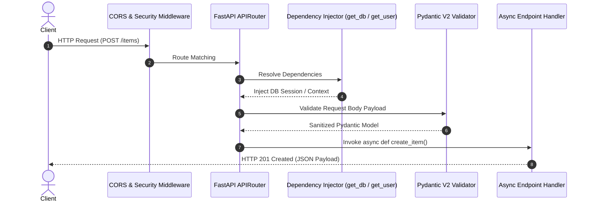

# FastAPI Tutorial: Building Production Async Web APIs & Microservices

**FastAPI** is the industry-standard Python framework for building high-performance, asynchronous REST APIs and microservices. Powered by Starlette for web routing and Pydantic V2 for schema validation, FastAPI achieves execution speeds competitive with Node.js and Go while providing automatic OpenAPI interactive documentation.

This tutorial builds a modular, production-ready FastAPI service with middleware, database dependency injection, error handlers, and lifecycle hooks.

---

## ⚡ FastAPI Architecture & Request Flow



---

## 💻 Complete Production FastAPI Application Code

```python
from fastapi import FastAPI, Depends, HTTPException, status, Query
from fastapi.middleware.cors import CORSMiddleware
from pydantic import BaseModel, Field, EmailStr
from typing import List, AsyncGenerator
import uvicorn

# 1. Initialize Application & Lifespan
app = FastAPI(
    title="Sahaya Savari Microservice API",
    version="1.0.0",
    docs_url="/docs",
    redoc_url="/redoc"
)

# 2. Add CORS Middleware
app.add_middleware(
    CORSMiddleware,
    allow_origins=["https://sahayasavari.me", "https://blog.sahayasavari.me"],
    allow_credentials=True,
    allow_methods=["*"],
    allow_headers=["*"],
)

# 3. Pydantic Models
class UserCreatePayload(BaseModel):
    username: str = Field(min_length=3, max_length=50)
    email: str = Field(description="User contact email address")
    role: str = Field(default="DEVELOPER", pattern="^(DEVELOPER|ADMIN|ENGINEER)$")

class UserResponse(BaseModel):
    user_id: int
    username: str
    email: str
    role: str
    is_active: bool

# 4. Dependency Injection Simulation
async def get_db_session() -> AsyncGenerator[str, None]:
    print("[DB Session] Initializing Async Connection Pool...")
    session = "AsyncDBSession_Active"
    try:
        yield session
    finally:
        print("[DB Session] Released Connection Back To Pool.")

# 5. Async Endpoint
@app.post(
    "/api/v1/users",
    response_model=UserResponse,
    status_code=status.HTTP_201_CREATED,
    summary="Create a new developer profile"
)
async def create_user(
    payload: UserCreatePayload,
    db: str = Depends(get_db_session)
):
    print(f"Executing query with DB Context [{db}] for email {payload.email}")
    return UserResponse(
        user_id=101,
        username=payload.username,
        email=payload.email,
        role=payload.role,
        is_active=True
    )

if __name__ == "__main__":
    uvicorn.run(app, host="127.0.0.1", port=8000)
```

---

## 🔄 Related Cluster Articles & Next Reading

- ➡️ **Next Reading**: [Pydantic V2 Deep Dive: Validation, Models & Performance](/blog/pydantic-v2-guide)
- 🔗 [SQLAlchemy 2.0 Async ORM & Migration Strategies](/blog/sqlalchemy-v2-guide)
- 🔗 [Asynchronous Python Guide: AsyncIO, Event Loops & Concurrency](/blog/async-python-guide)
