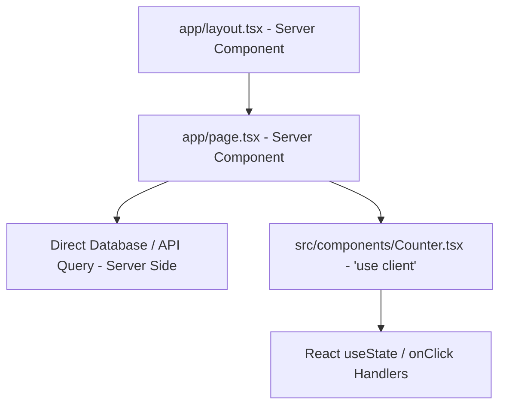

# Next.js App Router Architecture: Caching, Streaming, Server Actions & Metadata

The Next.js **App Router** (`app/` directory) represents a complete architectural paradigm shift built on React Server Components (RSC). By shifting component execution to the server by default, Next.js reduces client-side JavaScript bundle sizes while enabling server-side data fetching and streaming responses.

This guide details RSC vs Client Component boundaries, data caching strategies, dynamic route handlers, and SEO Metadata configuration.

---

## 🏗️ Server vs. Client Component Boundaries



---

## 💻 Code Example: Dynamic Route Handler with Server Actions

```tsx
// app/api/projects/[id]/route.ts
import { NextResponse } from 'next/server';

export async function GET(
  request: Request,
  { params }: { params: { id: string } }
) {
  const projectId = params.id;
  
  // Return JSON payload directly from server
  return NextResponse.json({
    project_id: projectId,
    title: `AI Agent Framework ${projectId}`,
    status: "ACTIVE",
    timestamp: new Date().toISOString()
  });
}
```

---

## 🔄 Related Cluster Articles & Next Reading

- ➡️ **Next Reading**: [Tailwind CSS v4 Engine & Utility Architecture](/blog/tailwind-css-v4-guide)
- 🔗 [React 19 Deep Dive: Compiler, Actions & Hooks](/blog/react-19-guide)
- 🔗 [Advanced React Performance: Profiling, Memoization & Web Vitals](/blog/react-performance-optimization)
